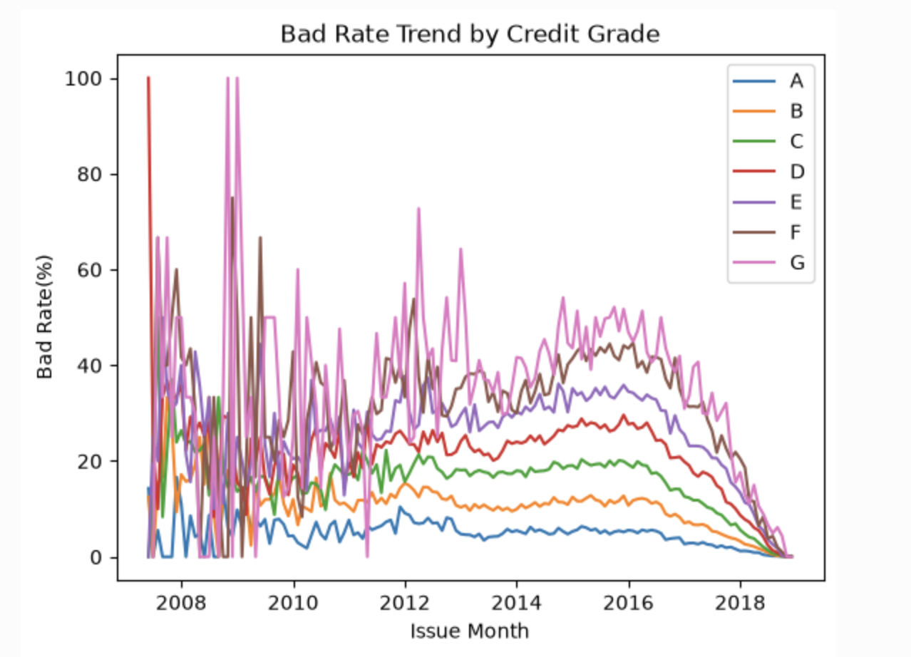
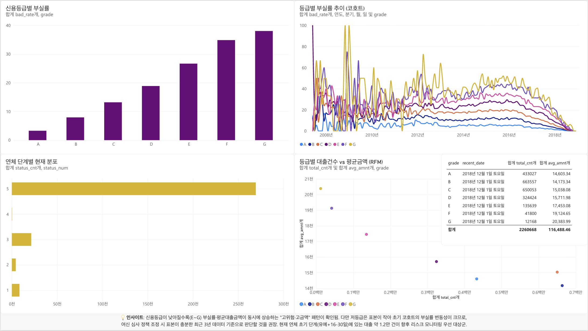

# Lending Club 대출 데이터 SQL 분석

## 사용 데이터
- All Lending Club loan data (Kaggle)
- DuckDB + jupysql로 분석 진행

## Q1. 전체 대출 중 부실률은 몇 %인가?

​```sql
SELECT 
    CAST(SUM(CASE WHEN loan_status IN ('Charged Off', 'Default', ...)
        THEN 1 ELSE 0 END) AS DOUBLE) / COUNT(*) * 100 AS bad_rate
FROM loan;
​```

**해석**
- 전체 대출 중 11.91%가 부실(Charged Off/Default)로 종결됨
- Lending Club 업계 평균(10~15%)과 비슷한 수준으로, 계산이 합리적임을 확인
- 다음 질문에서 이 부실률이 신용등급별로 어떻게 나뉘는지 확인할 예정

## Q2. 신용등급별 부실률은 어떻게 다른가?

​```sql
SELECT 
    grade,
    CAST(SUM(CASE WHEN loan_status IN ('Charged Off', 'Default', 'Does not meet the credit policy. Status:Charged Off')
            THEN 1 ELSE 0 END) AS DOUBLE)
    / COUNT(*) * 100 AS bad_rate,
    COUNT(*) AS total_cnt
FROM loan
GROUP BY grade
ORDER BY grade;
​```

**해석**
- 신용등급이 낮아질수록 부실률이 높아지는 것으로 확인됨 (A등급의 부실률->3.28%, G등급의 부실률->38.06%)
- 부실률과 반대로 등급별 대출건수는 상위 등급(A-D)일수록 많은 것으로 확인됨 (A-D등급의 대출건수->32만-66만 건, E-G등급의 대출건수->1만-13만 건)

## Q3. 신용등급별 부실률은 대출 실행 시기에 따라 어떻게 변하는가?
​
```sql
SELECT grade,
    CAST(SUM(CASE WHEN loan_status IN ('Charged Off', 'Default', 
        'Does not meet the credit policy. Status:Charged Off')
            THEN 1 ELSE 0 END) AS DOUBLE) / COUNT(*) * 100 AS bad_rate,
    CAST(DATE_TRUNC('month', STRPTIME(issue_d, '%b-%Y')) AS DATE) AS issue_month,
    COUNT(*) AS count_issue
FROM loan_clean
GROUP BY issue_month, grade
ORDER BY grade, issue_month;
```

쿼리 결과를 pandas로 받아 등급별 시계열 그래프로 시각화:


**해석**
- 신용등급이 낮을수록 부실률 추이 불안정성 심화 
- 신용등급이 높을수록 부실률 수준 낮음, 추이도 안정성을 보임: A등급은 10% 안팎, G등급은 20~50%대를 오가는 불안정성 추이
- 2016년 이후 부실률이 하락하는 것처럼 보이나, 이는 실제 리스크 개선이 아니라 **관찰 기간 편향(observation bias)**일 가능성이 높음: 최근에 발행된 대출은 아직 상환 기간(36/60개월)이 끝나지 않아 부실이 발생할 시간 자체가 부족했기 때문. 따라서 최근 코호트의 낮은 부실률을 "리스크가 개선됐다"고 해석하면 안 되며, 상환 기간이 충분히 지난 2007~2015년 코호트끼리만 비교하는 것이 더 정확함
- 2007~2010년 초반 극단값 존재: 건수 자체가 적어서 몇 건의 부실률이 튀게 나타나는 현상일 가능성 존재

## Q4. 퍼널 분석 - 연체 단계별 전환율, 이탈율 분석
​
```sql
SELECT
    COUNT(*) AS status_cnt,
    (CASE 
        WHEN loan_status = 'In Grace Period' THEN 1
        WHEN loan_status = 'Late (16-30 days)' THEN 2
        WHEN loan_status = 'Late (31-120 days)' THEN 3
        WHEN loan_status = 'Default' THEN 4
        WHEN loan_status = 'Charged Off' OR 
             loan_status = 'Does not meet the credit policy. Status:Charged Off' THEN 5
        END) AS status_num
FROM loan_clean
WHERE loan_status IN ('In Grace Period', 'Late (16-30 days)', 'Late (31-120 days)', 
                    'Default', 'Charged Off', 'Does not meet the credit policy. Status:Charged Off')
GROUP BY status_num
ORDER BY status_num;
```

**해석**
- 1단계(유예 상태)는 약 8천 건, 2단계(16-30일 연체)는 4천 건, 3단계(31-120일 연체)는 2만 1천 건으로 나타남.
- 4단계(121일 이상 연체)는 40건, 5단계(회수 불능)은 26만 건으로 수치가 급격히 증가함. 
- 이는 현 상태에 측정된 1~4단계와 달리, 5단계는 데이터가 집계되기 시작한 2007년부터 축적되었기 때문임. (이를 전환율로 해석해서는 안 됨)
- 현재 연체 초기 단계(1~2단계)에 있는 건이 약 1만 2천 건으로, 이들이 향후 장기 연체 또는 회수 불능으로 이어질 잠재 리스크군이 될 가능성 존재함.

## Q5. 윈도우 함수 - 신용등급별 부실률 순위 확인
​
```sql
SELECT
    grade,
    CAST(SUM(CASE WHEN loan_status IN ('Charged Off', 'Default', 'Does not meet the credit policy. Status:Charged Off')
            THEN 1 ELSE 0 END) AS DOUBLE) / COUNT(*) * 100 AS bad_rate,
    CAST(DATE_TRUNC('month', STRPTIME(issue_d, '%b-%Y')) AS DATE) AS issue_month,
    RANK() OVER(PARTITION BY issue_month ORDER BY bad_rate DESC) AS bad_rate_rank
FROM loan_clean
WHERE issue_month >= '2011-01-01'
GROUP BY issue_month, grade
ORDER BY grade, issue_month;
```

**해석**
- 1등 순위 = 부실률 가장 높음(위험) -> 7등 순위 = 부실률 가장 낮음(안전)
- 초기 년도(2007~2010) 코호트: 표본 부족으로 순위가 불안정한 양상을 보임 
- 중기 이후 년도(2011~) 코호트: 표본이 충분해지면서 A등급이 6-7등(부실률이 낮은 순위)으로 나타남 - 신용평가 체계의 신뢰성을 시계열로 검증

## Q6. RFM 분석 - 신용등급별 패턴 분석

```sql
SELECT
    grade,
    MAX(STRPTIME(issue_d, '%b-%Y')) AS recent_date,
    COUNT(*) AS total_cnt,
    AVG(loan_amnt) AS avg_amnt
FROM loan_clean
GROUP BY grade
ORDER BY grade;
```

**고객 단위 식별자(member_id)가 없어 전통적 RFM 대신 신용등급 세그먼트 기준으로 변형 적용함.**
- Recency: 등급별 가장 최근 대출 실행일 파악
- Frequency: 등급별 총 대출 건수
- Monetary: 등급별 평균(또는 총) 대출 금액

**해석**
- Recency: 모든 등급의 최근 대출 실행일이 '2018-12-01'로 동일: 마지막으로 관측된 데이터 날짜로 추정, Recency로는 등급 간 차이 파악 불가함. 
- Frequency: 고등급(A-D)이 압도적으로 많고, 저등급(E-G)으로 갈수록 급격히 적어지는 건수 패턴이 나타남.
- Monetary: A등급이 가장 낮고(약 $14,603), G등급이 가장 높음(약 $20,384). 신용등급이 낮을수록 평균 대출금액이 큰 패턴을 보임. - 저신용 등급일수록 대출금액은 크지만, 갚을 가능성은 더 낮은 고위험/고금액 조합 패턴이 드러남.

## 종합 해석
- 신용등급 체계는 부실률(Q2), 순위 안정성(Q5), 평균 대출금액(Q6) 세 지표 모두에서 일관되게 리스크를 반영하고 있음을 확인함 - 등급이 낮을수록 부실률, 평균 대출금액은 커지고 부실률 순위는 낮아짐(안전)
- 다만 해당 데이터는 대출 이력을 추적하는 로그가 아닌 정적 스냅샷이라는 한계가 있어, 코호트(Q3)와 퍼널(Q4) 분석에서의 '관찰 기간 편향'과 '현재 상태'를 고려하지 않으면 잘못된 결론에 도달할 수 있음을 주의해야 함.
- 종합해 보면, 저신용 등급(E-G)은 '대출 금액의 규모는 크지만 표본이 적고 변동성이 큰' 고위험 세그먼트로, 여신 심사/모니터링 정책에서 우선 관리 또는 추적 관리 대상으로 삼아야 할 근거라는 것이 데이터로 뒷받침됨.

## Power BI 대시보드

DuckDB로 뽑은 등급별 부실률, 코호트, 퍼널, RFM 집계 결과를 
Power BI를 활용해 시각화함.



**구성**
- 신용등급별 부실률 (막대차트)
- 등급별 부실률 추이 - 코호트 (꺾은선차트)
- 연체 단계별 현재 분포 (막대차트)
- 등급별 대출건수 vs 평균금액 - RFM (분산형차트 + 테이블)

**인사이트**
- 신용등급이 낮아질수록(E~G) 부실률·평균대출금액이 동시에 상승하는 
"고위험·고금액" 패턴이 확인됨. 다만 저등급은 표본이 작아 초기 코호트의 
부실률 변동성이 크므로, 여신 심사 정책 조정 시 표본이 충분한 최근 3년 
데이터 기준으로 판단할 것을 권장. 현재 연체 초기 단계(유예+16-30일)에 
있는 대출 약 1.2만 건이 향후 리스크 모니터링 우선 대상군.

**참고**
- Mac 환경으로 Power BI Desktop 대신 Power BI Service(웹)를 사용함
- 원본 데이터가 대용량(1.6GB)이라, DuckDB에서 사전 집계한 요약 테이블만 업로드하여 시각화함